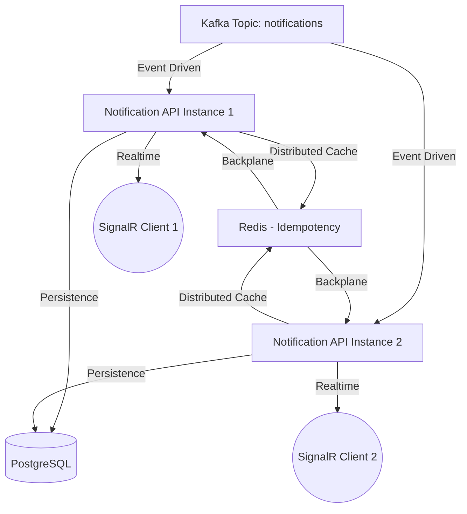

# NotificationService - Handover Documentation

This document provides a comprehensive overview of the **NotificationService**, a high-performance, event-driven notification system built using .NET 9 Clean Architecture. It is designed to handle massive scale while maintaining message idempotency and real-time delivery.

## 🏛️ System Architecture

The system follows an event-driven architecture utilizing Apache Kafka as the central nervous system.



### Key Components:
- **Broker (Kafka)**: Decouples producers from consumers. Configured with 6 partitions to support horizontal scaling.
- **Idempotency (Redis)**: Ensures each `EventId` is processed exactly once, preventing duplicate notifications.
- **Backplane (Redis)**: Synchronizes SignalR messages across multiple server instances.
- **Persistence (PostgreSQL)**: Stores `NotificationLogs` for auditing and delivery tracking using the Repository Pattern.
- **Delivery (SignalR)**: Pushes notifications to specific users via persistent WebSockets.

---

## 🛠️ Technology Stack

- **Runtime**: .NET 9.0 (ASP.NET Core)
- **Database**: PostgreSQL 15 (Entity Framework Core)
- **Messaging**: Apache Kafka (Confluent.Kafka)
- **Caching**: Redis 7 (StackExchange.Redis)
- **Real-time**: SignalR with Redis Backplane
- **Containerization**: Docker & Docker Compose

---

## 🚀 Scaling Strategy

The system is designed for **High Throughput** and **High Availability**.

### Horizontal Scaling
- **API Nodes**: You can increase the number of API instances (e.g., `api3`, `api4`) in `docker-compose.yml`. 
  - *Requirement*: The number of instances should not exceed the number of Kafka partitions (currently 6). 
- **Consumer Groups**: By sharing the same `GroupId`, Kafka automatically balances the load among instances.

### Vertical Scaling
- **Kafka Partitions**: If business volume grows, increase the number of partitions (e.g., to 24) to support more parallel processing nodes.
- **Brokers**: For production, transition from a single broker to a **3-broker cluster** to prevent data loss if one node fails.

---

## 📡 API & Hub usage

### 1. SignalR Hub (Real-time)
- **URL**: `http://localhost:5027/hubs/notifications`
- **Method**: WebSocket / Long Polling
- **Authentication (Current)**: Pass `userId` via query string (e.g., `?userId=user-123`).
- **Client Method**: Listen for `ReceiveNotification`.

### 2. Audit Logs (REST)
- **URL**: `GET /api/logs`
- **Description**: Returns the latest 50 processed notification entries from the database.

---

## 🧪 Testing & Verification

### The "Mega Bomb" Test
To test the system's ability to handle high load (e.g., 10,000 messages), use the following PowerShell script:

```powershell
$messages = 1..10000 | ForEach-Object {
    $uid = "u$($_ % 50)"
    $eid = "bomb-$_"
    "${uid}:{`"EventId`":`"$eid`",`"UserId`":`"$uid`",`"Message`":`"🔥 Test Message #$_`",`"Type`":`"Alert`"}"
}
$messages -join "`n" | docker exec -i notificationservice-kafka-1 kafka-console-producer --broker-list localhost:9092 --topic notifications --property "parse.key=true" --property "key.separator=:"
```

### Verification UI
Access `tester.html` in your browser. It includes:
- **Dual Instance Connections**: Port 5027 and 5028.
- **Auto-Refresh Logs**: Real-time view of PostgreSQL persistence.
- **Performance Optimized**: UI remains responsive even during 10k message bursts.

---

## 🛡️ Production Roadmap

To move this project to a production environment, implement the following:

1.  **Security**:
    - Replace the `QueryStringUserIdProvider` with **JWT Bearer Authentication**.
    - Implement HTTPS for all communication.
2.  **Infrastructure**:
    - Use a managed Kafka service (e.g., Confluent Cloud, Amazon MSK).
    - Configure PostgreSQL Replication/Backups.
3.  **Observability**:
    - Integrate **Serilog** with ELK or Seq.
    - Implement **Health Checks** (`/health`) and monitoring with Prometheus/Grafana.
4.  **Senders**:
    - Replace `StubSenders` with real implementations (SendGrid, Twilio, Firebase).

---

> [!IMPORTANT]
> Always ensure that the `GroupId` remains consistent across all API instances to maintain the load-balancing property of the Kafka Consumer Group.
